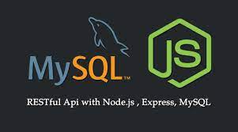
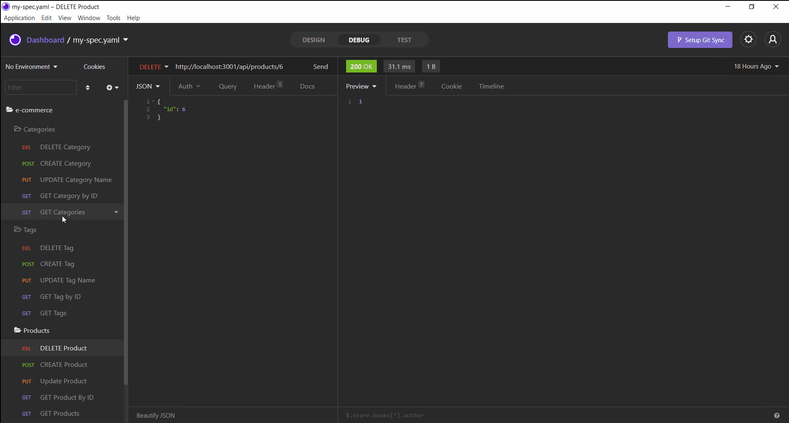
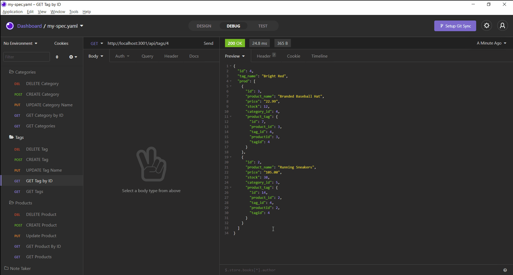
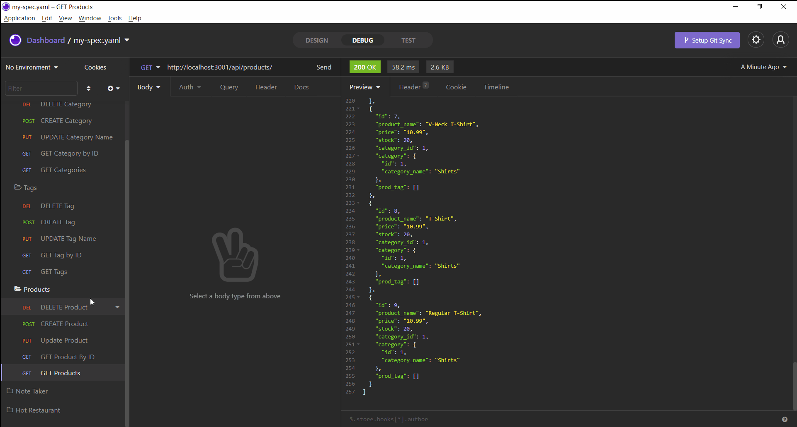

# 🛍️ E-Commerce Back End


## 📝Description

```
E-Commerce is a Node-JS back-end application that interacts with a MySql
database to create, retrieve, update and delete products. 
```

## 🧰 Technologies Used

* `Node.js`
* `npm (Node Package Manager)`
* `Javascript`
* `Sequelize`
* `MySQL2`
* `Express.js`
* `Insomnia Core`

## 📄 Installation Instructions

You will need to install MySQL2, Sequelize, and Express.js packages using npm. You will also need a local installation of MySql with Workbench if you want to install and test the applciation locally. A `schema.sql` file can be found in the db folder as well as multiple `seed.js` files to populate the database with sample data. 


## 📸 Application Demos

> Category Demonstrations



> Tag Demonstrations



> Product Demonstrations



## 📱 Contact 

Malcolm Mason - [Github](https://github.com/malmason) Email: [Malcolm](mailto:malmason66@gmail.com) 📧

---

&copy; 2021 Malcolm Mason